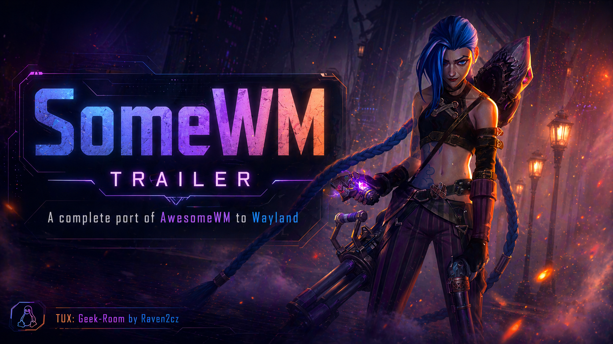

# somewm-one

> Reference configuration and widget framework for
> [**somewm**](https://github.com/trip-zip/somewm) - *AwesomeWM on Wayland,
> at last.*

[](LICENSE)
[](https://awesomewm.org/)
[](https://gitlab.freedesktop.org/wlroots/wlroots)

<p align="center">
  <a href="https://youtu.be/QCiAMZFddSc">
    
  </a>
</p>
<p align="center"><em>► <a href="https://youtu.be/QCiAMZFddSc">Watch the somewm trailer on YouTube</a> · screenshots coming soon</em></p>

## What is this?

`somewm-one` is an opinionated starting point for anyone using the
[somewm](https://github.com/trip-zip/somewm) compositor. It keeps the full
AwesomeWM Lua API you already know (`client`, `tag`, `screen`, signals,
`rc.lua`, `awful.*`, `beautiful`, `naughty`) and adds a small framework
called **fishlive** for building themed, reactive widgets without
per-widget polling loops.

- **A 210-line `rc.lua`**: pure orchestration, no 1500-line config
  spaghetti. All logic lives under `fishlive.config.*` with an explicit
  `.setup()` convention and a deterministic load order.
- **The fishlive framework**: a lightweight pub/sub broker, reusable services
  (producers), and reactive components (widgets). For example, a single `/proc/stat`
  reader can feed multiple CPU meters across different screens with zero extra polling overhead.
- **First-class shell integration**: ships the `somewm-client` bridge to
  [somewm-shell](https://github.com/raven2cz/somewm-shell), a modern
  Quickshell-based overlay shell (dashboard, dock, OSD, hot edges).

If you already write AwesomeWM configs, you are already 90% home. Signals
fire the same way, `awful.*` is the same API, themes are `theme.lua`.

## Requirements

- [`somewm`](https://github.com/trip-zip/somewm) compositor ≥ current
  `main`
- Lua 5.1 or LuaJIT (same runtime AwesomeWM uses)
- Standard AwesomeWM deps (via pacman on Arch): `luarocks`, `lua-lgi`,
  `gdk-pixbuf2`, `librsvg`
- Optional: [somewm-shell](https://github.com/raven2cz/somewm-shell) for
  the dashboard/dock overlay

## Quick start

```bash
git clone https://github.com/raven2cz/somewm-one.git
cd somewm-one

# Deploy to the active config (~/.config/somewm)
./deploy.sh

# Reload a running somewm session without losing windows
somewm-client reload
```

Then launch `somewm` from a TTY (or your display manager). Default modkey
is `Mod4` (Super).

## Troubleshooting

- **`somewm-client: command not found`**: Ensure the `somewm` compositor is built, installed, and present in your system's `$PATH`.
- **Lua errors on startup**: Check the compositor logs in your TTY. Missing dependencies like `lua-lgi` or `gdk-pixbuf2` are the most common cause.
- **Missing widgets**: Check that `fishlive/services/init.lua` has been required at startup and that each service registers its producer. A common symptom is a widget rendering but never updating - verify the corresponding service file is listed in the registry.

## Documentation

| Document | What's in it |
|----------|--------------|
| [**GUIDE.md**](GUIDE.md) | Architecture, fishlive framework, load-order invariant, development workflow, adding new services/components/keybindings |
| [**STYLE.md**](STYLE.md) | File headers, module init conventions (`.setup()` pattern), IPC naming |
| [fishlive.autostart](../../docs/fishlive-autostart.md) | Wayland-native autostart reference: state machine, gates, hot-reload, IPC inspection |
| [somewm-shell IPC](https://github.com/raven2cz/somewm-shell/blob/main/IPC.md) | Full Lua ↔ Shell contract (handlers + `awesome._*` globals) |

## Repository layout

```
somewm-one/
├── rc.lua               # 210-line orchestrator
├── deploy.sh            # rsync → ~/.config/somewm
├── fishlive/
│   ├── broker.lua       # pub/sub signal bus
│   ├── factory.lua      # theme-aware widget resolver
│   ├── config/          # keybindings, menus, screen, rules, titlebars, …
│   ├── services/        # producers (cpu, gpu, memory, volume, spotify, …)
│   └── components/      # widgets (cpu, memory, volume, spotify, clock, …)
├── themes/
│   └── default/         # Gruvbox Material reference theme
├── layout-machi/        # vendored layout engine
└── spec/                # busted unit tests
```

## Contributing

1. Edit in this repo (or your fork).
2. Add a header (`STYLE.md`) and, for new services/components, a spec
   under `spec/`.
3. Run the header lint and unit tests:
   ```bash
   # check-headers.sh lives in the v2.0 work-in-progress fork (raven2cz/somewm):
   bash "${SOMEWM_FORK_PATH:-$HOME/git/github/somewm}/plans/scripts/check-headers.sh"
   busted spec/
   ```
4. Commit with a conventional message (`feat:`, `fix:`, `refactor:`,
   `docs:`).

## Credits

- **[AwesomeWM](https://github.com/awesomeWM/awesome)**: the original
  Lua API, object model and widget system this project tracks. Website:
  [awesomewm.org](https://awesomewm.org/).
- **[somewm](https://github.com/trip-zip/somewm)** by
  [@trip-zip](https://github.com/trip-zip) - the wlroots port that made
  AwesomeWM-on-Wayland real. This is the canonical upstream project
  `somewm-one` is built for.
  *Note: I also maintain a [development fork at raven2cz/somewm](https://github.com/raven2cz/somewm)
  where active work toward somewm 2.0 happens (focus/input fixes, NVIDIA
  workarounds, SceneFX integration, animation framework). It tracks
  upstream and contributes back via PRs; use it only if you specifically
  need one of the in-flight changes.*
- **[layout-machi](https://github.com/xinhaoyuan/layout-machi)** by
  [@xinhaoyuan](https://github.com/xinhaoyuan) - the interactive tiling
  layout engine vendored under `layout-machi/`.
- **[rubato](https://github.com/andOrlando/rubato)** by
  [@andOrlando](https://github.com/andOrlando) - the Lua animation
  library vendored under `fishlive/rubato/`.
- **[Quickshell](https://quickshell.outfoxxed.me/)**: the engine behind
  the companion [somewm-shell](https://github.com/raven2cz/somewm-shell).

## License

- **MIT**: `fishlive/` framework, `rc.lua`, themes, scripts
- **GPL**: upstream AwesomeWM Lua code bundled by the compositor
  (see the somewm repository)
